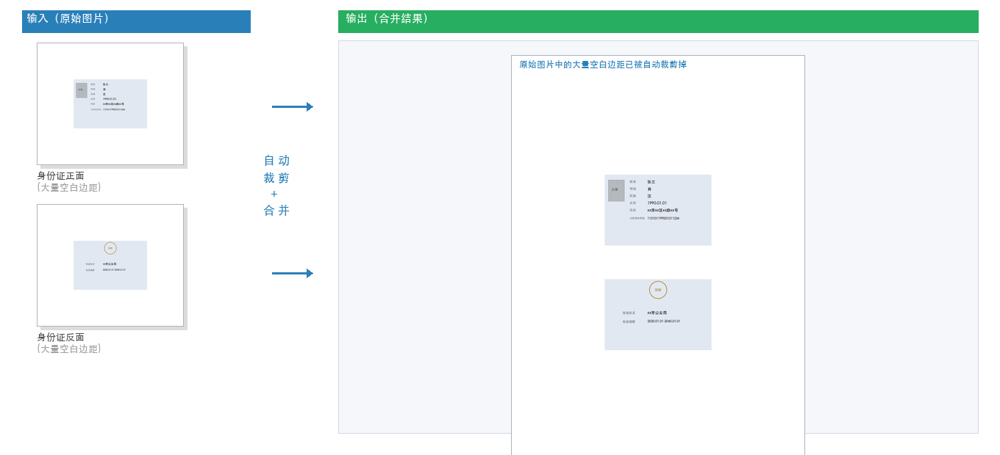

# ID Card Merge

自动裁剪并合并身份证正反面为一张图片，适合打印。



## 依赖

```bash
pip install -r requirements.txt
```

## 用法

```bash
python id_card_merge.py 正面图片.jpg 反面图片.jpg -o 输出.jpg -g 100
```

### 选项

| 参数 | 说明 | 默认值 |
|---|---|---|
| `front` | 正面图片路径 | 必填 |
| `back` | 反面图片路径 | 必填 |
| `-o, --output` | 输出图片路径 | `id_card_merged.jpg` |
| `-g, --gap` | 正反面间距（像素） | `100` |
| `-a, --align` | 对齐方式：`left` 或 `center` | `left` |
| `-t, --target` | 画布尺寸 `宽x高` | `1654x2338` |
| `--threshold` | 内容边界检测阈值 | `250` |

### 示例

```bash
# 基本用法，间距 80px，居中对齐
python id_card_merge.py front.jpg back.jpg -g 80 -a center

# 自定义输出路径和画布尺寸
python id_card_merge.py a.jpg b.jpg -o result.jpg -t 1200x1600
```

## 原理

核心函数 `find_content_bounds` 找到身份证内容区域的边界，配合代码逐步解释：

### 纵向检测（上/下边界）

```python
# 计算每一行的平均亮度
row_avg = []
for y in range(h):
    s = sum(px[x, y] for x in range(w))
    row_avg.append(s / w)
```

身份证区域（文字、照片）比白背景暗，所以平均亮度更低。

```python
# 对行平均亮度做滑动平均（窗口 20 行）
window = 20
smooth = []
for y in range(h):
    start = max(0, y - window)
    end = min(h, y + window + 1)
    smooth.append(sum(row_avg[start:end]) / (end - start))
```

滑动平均得到平滑后的背景亮度曲线。四周纯白接近 255，中间暗区域使平滑值介于中间。

```python
# 实际亮度比平滑值越低，差值越大
diffs = [smooth[y] - row_avg[y] for y in range(h)]
max_diff = max(diffs)
thresh = max_diff * 0.3

top = next(y for y in range(h) if diffs[y] > thresh)
bottom = next(y for y in range(h-1, -1, -1) if diffs[y] > thresh)
```

身份证区域实际亮度明显低于平滑值，所以 `smooth - row_avg` 差值大。取差值最大值 × 0.3 为阈值，**动态自适应每张图**，比固定阈值（如 240）更稳定，不受浅灰渐变背景影响。

### 横向检测（左/右边界）

```python]
left = next(x for x in range(w) if any(px[x, y] < threshold for y in range(top, bottom+1)))
right = next(x for x in range(w-1, -1, -1) if any(px[x, y] < threshold for y in range(top, bottom+1)))
```

在已确定的 `top~bottom` 行范围内，从左/右往中间找第一列存在亮度 < 250 的像素——即身份证内容的左右边缘。此时行范围已精确，列方向用简单阈值即可。

### 扩展 padding

```python
padding = 45
left = max(0, left - padding)
top = max(0, top - padding)
right = min(w - 1, right + padding)
bottom = min(h - 1, bottom + padding)
```

检测的边界紧贴内容边缘，向外扩展 45px 避免误裁。

### 合并

```python
max_w = max(c.size[0] for c in cropped)

if align == "left":
    x_off = (target_w - max_w) // 2
else:
    x_off = None

total_h = cropped[0].size[1] + gap + cropped[1].size[1]
merged = Image.new("RGB", (target_w, target_h), (255, 255, 255))
y_off = (target_h - total_h) // 2
x_off = (target_w - max_w) // 2

for c in cropped:
    if align == "center":
        x_off = (target_w - c.size[0]) // 2
    merged.paste(c, (x_off, y_off))
    y_off += c.size[1] + gap
```

- `max_w`：找出两张身份证中最宽的宽度，用于左对齐时统一偏移量
- `x_off`：`left` 模式以最宽为基准水平居中；`center` 模式每张图各自居中（宽窄不同的身份证各自独立居中）
- `y_off = (target_h - total_h) // 2`：画布高度减去内容总高度，除以 2 实现垂直居中
- 每次 `paste` 后，`y_off += c.size[1] + gap` 下移，为下一张留位置
